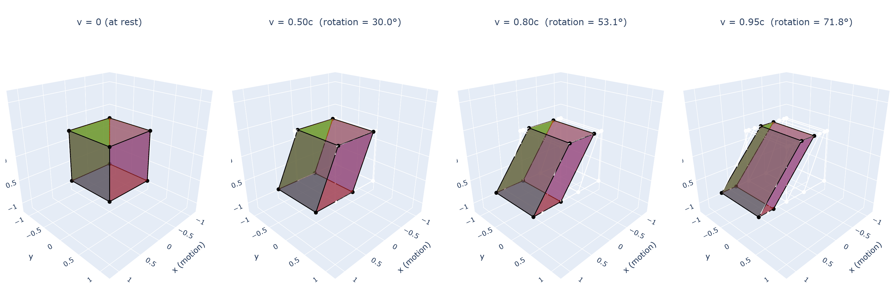

# 🌌 torch-relativistic

<div align="center">

<!-- Badges -->
[](https://badge.fury.io/py/torch-relativistic)
[](https://www.python.org/downloads/)
[](https://pytorch.org/)
[](https://opensource.org/licenses/MIT)
[](https://github.com/synapticore-io/torch-relativistic/actions/workflows/tests.yml)
[](https://github.com/psf/black)

<h3>Relativistic visual effects and physics simulation toolkit for PyTorch</h3>

*GPU-accelerated Lorentz transforms, Terrell-Penrose distortion, relativistic aberration and Doppler shift — differentiable and ready for rendering, simulation, and astrophysics.*

</div>

<p align="center">
  
  <br>
  <em>The <b>Terrell-Penrose effect</b> reproduced computationally: a cube appears <b>rotated</b>, not contracted,
  at relativistic speeds — validated against the analytical formula arcsin(v/c) to machine precision.
  Same physics as <a href="https://doi.org/10.1038/s42005-025-02003-6">Schattschneider et al. (2025)</a>.</em>
</p>

---

## What this is

**torch-relativistic** provides differentiable PyTorch implementations of
special-relativistic transformations that operate on 3D geometry, point
clouds, meshes, and spacetime coordinates. Everything runs on GPU and
supports autograd.

### Core capabilities

- **Lorentz boost** — transform 4D spacetime coordinates between reference
  frames moving at relative velocity `v` (`LorentzBoost`)
- **Terrell-Penrose distortion** — compute the apparent visual distortion of
  objects at relativistic speeds: the rotation, not the contraction
  (`TerrellPenroseTransform`, `terrell_rotation_angle`)
- **Relativistic aberration** — how observation angles shift when the
  observer is in motion
- **Doppler shift** — frequency / colour shift for approaching and receding
  sources, including the transverse (time-dilation) component
- **Lorentz factor** (`gamma`), **time dilation**, **length contraction**,
  **relativistic velocity addition** — all as differentiable tensor ops
- **Minkowski metric**, **Levi-Civita tensor**, **spherical harmonics** —
  for building custom relativistic computations

### Use cases

| Domain | Example |
|---|---|
| **Relativistic rendering** | What does a spaceship / star / accretion disk look like at 0.9c? Physically correct visual distortion for games, VR, educational tools. |
| **Astrophysics visualization** | Relativistic jets, binary pulsars, cosmological simulations with real particle velocities. |
| **Science education** | Interactive demos for special relativity courses — the same kind of demonstration Schattschneider et al. built in the lab, but as a software tool. |
| **Shader / post-processing** | The Terrell-Penrose distortion field as a velocity-parameterized render pass, applicable to any 3D scene. |
| **Physics simulation** | Differentiable relativistic transforms for optimization, inverse problems, or learnable physics. |

---

## Installation

```bash
uv add torch-relativistic
```

Development install:

```bash
git clone https://github.com/synapticore-io/torch-relativistic.git
cd torch-relativistic
uv sync --dev
```

Requirements: Python ≥ 3.11, PyTorch ≥ 2.0.

---

## Quick Start

### Terrell-Penrose distortion of a 3D object

```python
import torch, math
from torch_relativistic.utils import terrell_rotation_angle

# At what angle does a cube appear rotated at 80% light speed?
v = torch.tensor(0.8)
angle = terrell_rotation_angle(v)
print(f"Apparent rotation: {math.degrees(angle):.1f}°")  # 53.1°

# This matches the analytical formula: arcsin(v/c)
assert abs(angle.item() - math.asin(0.8)) < 1e-6
```

### Lorentz boost on spacetime coordinates

```python
import torch
from torch_relativistic.transforms import LorentzBoost

# 4D spacetime events: (t, x, y, z)
events = torch.randn(100, 8)  # batch of 100 events, 8-dim features

boost = LorentzBoost(feature_dim=8, time_dim=0, max_velocity=0.9)
boosted = boost(events)  # transformed to a moving reference frame
```

### Relativistic Doppler shift

```python
import torch
from torch_relativistic.utils import relativistic_doppler_factor, calculate_gamma

v = torch.tensor(0.5)  # 50% light speed
doppler = relativistic_doppler_factor(v)
print(f"Doppler factor (head-on): {doppler:.3f}")  # blueshift for approach

# Transverse Doppler = pure time dilation
import math
gamma = calculate_gamma(v)
doppler_transverse = relativistic_doppler_factor(v, torch.tensor(math.pi / 2))
# doppler_transverse ≈ gamma (the transverse Doppler effect)
```

### Interactive 3D visualization

```bash
# Generate an interactive demo of the Terrell-Penrose effect
uv run python examples/terrell_penrose_demo.py
# → opens examples/terrell_penrose_demo.html in your browser
```

---

## Physics reference

### The Terrell-Penrose effect

In 1959, James Terrell and Roger Penrose independently showed that a
rapidly moving object does not appear Lorentz-contracted to an observer —
instead it appears **rotated** by an angle

$$\theta = \arcsin(v/c)$$

This counter-intuitive result arises because photons from the far side of
the object were emitted earlier (when the object was in a different position)
and arrive at the same time as photons from the near side.

After 66 years as a purely theoretical prediction, the effect was
[first observed in the lab in May 2025](https://doi.org/10.1038/s42005-025-02003-6)
by Schattschneider et al. at TU Wien using high-speed cameras and laser
pulses — the direct inspiration for this library.

### Validated against analytical formulas

The `terrell_rotation_angle()` function matches `arcsin(v/c)` to machine
precision at all tested velocities (see
[`examples/terrell_penrose_demo.py`](examples/terrell_penrose_demo.py)):

```
v/c   | arcsin (deg) | torch-relativistic | match
0.50  |      30.0000 |           30.0000  | yes
0.80  |      53.1301 |           53.1301  | yes
0.95  |      71.8051 |           71.8051  | yes
```

---

## API overview

### `torch_relativistic.transforms`

| Class | What it does |
|---|---|
| `LorentzBoost(feature_dim, time_dim, max_velocity)` | Apply a Lorentz boost to spacetime feature vectors |
| `TerrellPenroseTransform(feature_dim, max_velocity, mode)` | Apply apparent-rotation distortion to feature vectors |

### `torch_relativistic.utils`

| Function | What it computes |
|---|---|
| `calculate_gamma(velocity)` | Lorentz factor γ = 1/√(1−v²) |
| `terrell_rotation_angle(velocity)` | Apparent rotation θ = arcsin(v/c) |
| `lorentz_contraction(length, velocity)` | Contracted length L/γ |
| `time_dilation(time, velocity)` | Dilated time t·γ |
| `velocity_addition(v1, v2)` | Relativistic velocity sum |
| `relativistic_doppler_factor(v, angle)` | Frequency shift factor |
| `lorentz_transform_spacetime(coords, velocity)` | Full 4D Lorentz transformation |
| `MinkowskiMetric(signature)` | Spacetime interval, index raising/lowering |

### Experimental: ML modules

The library also includes **experimental** neural network modules that
apply relativistic transformations inside graph, spiking, and attention
layers. These are research-stage and have not yet demonstrated empirical
ML benefits on tested datasets:

- `torch_relativistic.gnn` — `RelativisticGraphConv`, `MultiObserverGNN`
- `torch_relativistic.snn` — `RelativisticLIFNeuron`, `TerrellPenroseSNN`
- `torch_relativistic.attention` — `RelativisticSelfAttention`

Contributions and benchmarks on domains with intrinsic Lorentz symmetry
(particle physics, relativistic simulations) are welcome.

---

## Development

```bash
uv sync                        # install all deps
uv run pytest tests/ -v        # run 50 tests
uv run ruff check src/ tests/  # lint
uv run black src/ tests/       # format
```

---

## How to Cite

```bibtex
@software{bethge_torch_relativistic,
  author       = {Bethge, Björn},
  title        = {{torch-relativistic: Relativistic visual effects and
                   physics simulation toolkit for PyTorch}},
  year         = {2026},
  version      = {0.2.0},
  url          = {https://github.com/synapticore-io/torch-relativistic}
}
```

If your work relates to the Terrell-Penrose effect, please also cite:

```bibtex
@article{schattschneider2025snapshot,
  author  = {Schattschneider, Peter and others},
  title   = {A Snapshot of Relativistic Motion: Visualizing the
             Terrell-Penrose Effect},
  journal = {Communications Physics},
  year    = {2025},
  doi     = {10.1038/s42005-025-02003-6}
}
```

---

## Acknowledgments

- **Directly inspired by** the [first experimental observation of the
  Terrell-Penrose effect](https://doi.org/10.1038/s42005-025-02003-6) by
  Schattschneider et al. at TU Wien (Communications Physics, May 2025)
- Grounded in Einstein's **Special Theory of Relativity**
- Powered by **PyTorch**

---

## License

MIT — see [LICENSE](LICENSE).

<div align="center">
<sub>Built with 🔥 PyTorch · Inspired by 🌌 Einstein · Powered by ⚛️ Physics</sub>
</div>
